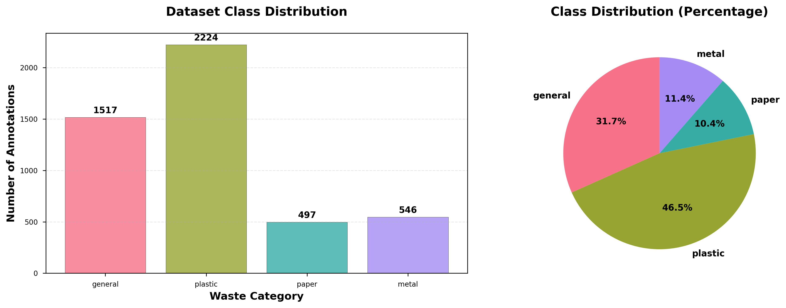
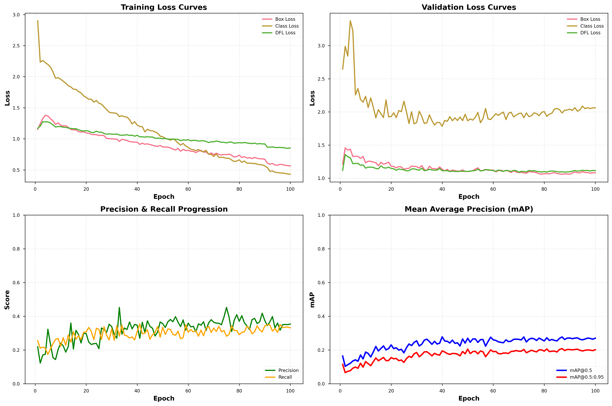
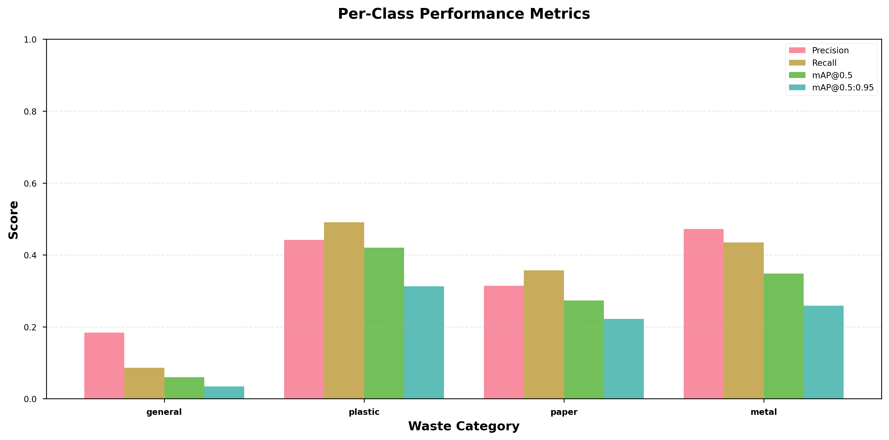
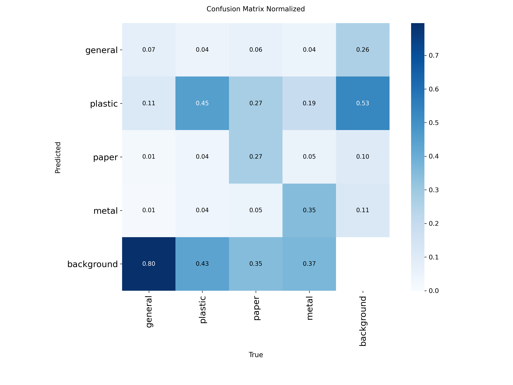
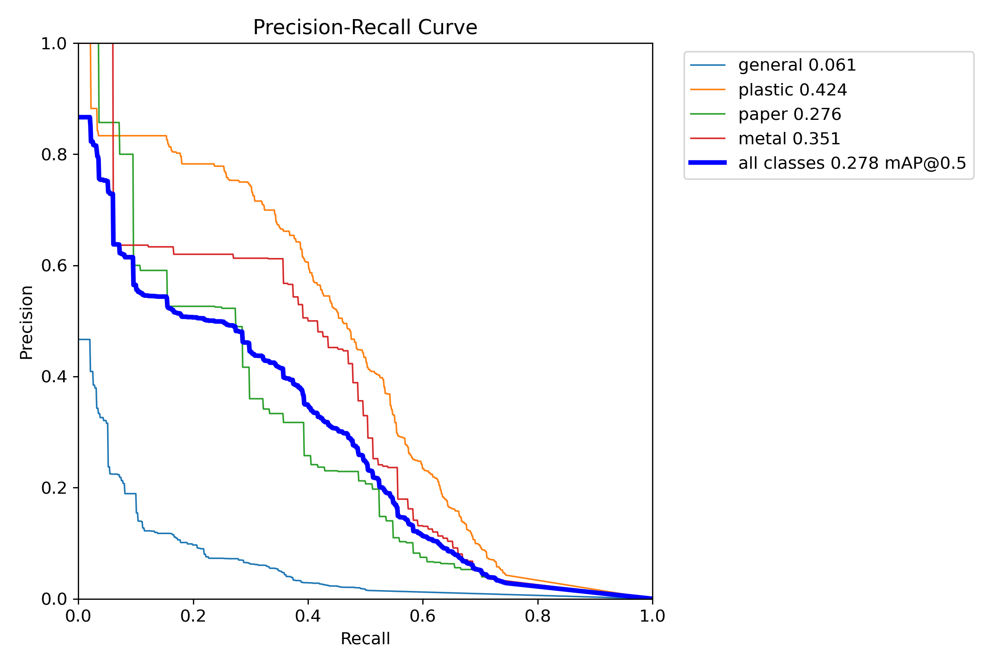
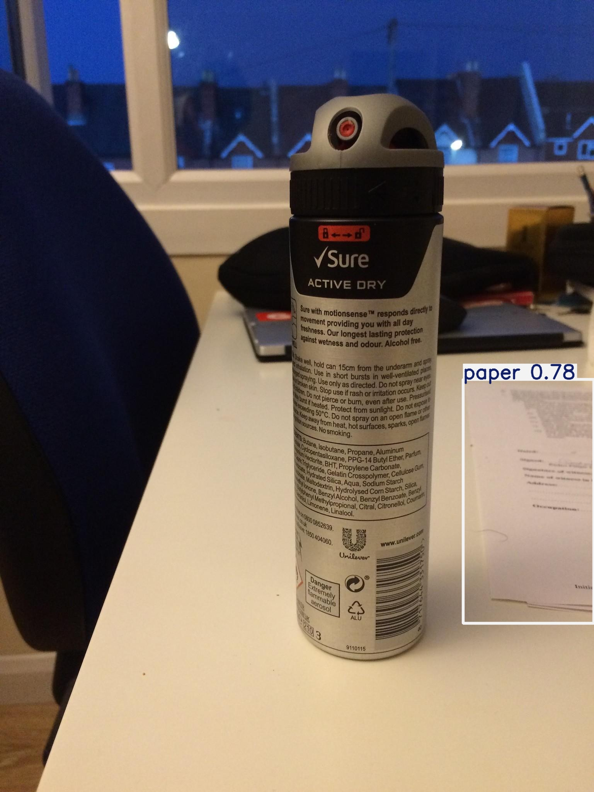
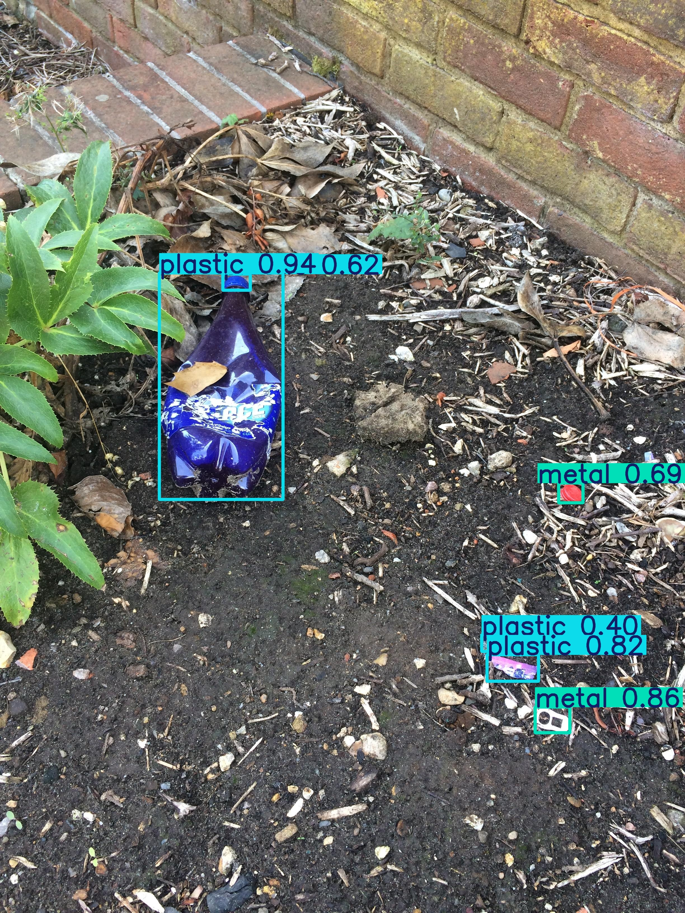
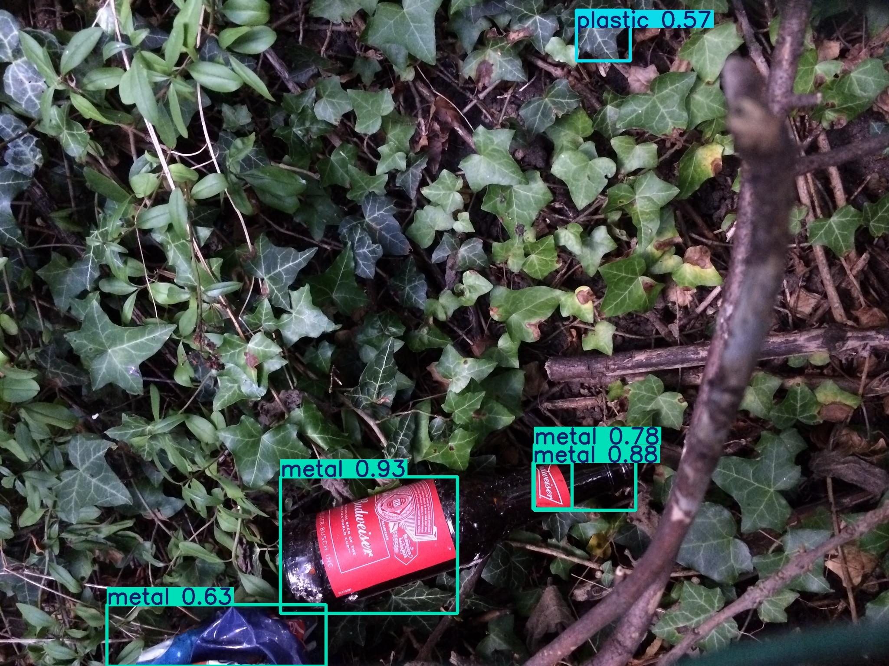

# Automated Waste Sorting via YOLOv8 Object Detection

## Introduction

With global waste generation expected to increase 70% by 2050, the environmental and economic pressures on waste management systems continue to mount. Computer vision-based sorting presents an opportunity to improve recycling efficiency while reducing labor costs. We trained a YOLOv8-based detector on the TACO dataset to classify waste into four recyclable categories: **general**, **plastic**, **paper**, and **metal**.

## Methodology

We used the TACO (Trash Annotations in Context) dataset, consolidating its 60 original classes into 4 categories aligned with typical municipal recycling streams. The resulting dataset contains 4784 annotations split approximately 70/15/15 across training, validation, and test sets.

The detector is based on YOLOv8s (11M parameters, 28.4 GFLOPs), initialized with COCO pretrained weights. Training ran for 100 epochs at 640×640 resolution with batch size 16, using AdamW optimization and cosine annealing. Standard augmentations included mosaic composition, HSV color jitter, random scaling, and horizontal flipping.

We evaluated performance using precision, recall, mAP@0.5, and mAP@0.5:0.95. Results are presented through training curves, confusion matrices, per-class breakdowns, and annotated detection examples.

**Figure 1.** Class distribution across 4784 annotations. Plastic dominates (46.5%), followed by general waste (31.7%), metal (11.4%), and paper (10.4%).

## Results

The model achieved mAP@0.5 of **0.270** and mAP@0.5:0.95 of **0.202**, with precision of 0.354 and recall of 0.331. Training converged over 100 epochs (2.4 hours) without significant overfitting (Table 1, Figure 2).

**Figure 2.** Training dynamics. Loss components decrease steadily, while mAP and precision/recall improve without divergence between train and validation sets.

### Table 1. Overall Performance

| Metric       | Value | Interpretation                                 |
| ------------ | ----- | ---------------------------------------------- |
| Precision    | 0.354 | About 35% of detections are correct            |
| Recall       | 0.331 | Captures roughly 33% of actual waste items     |
| mAP@0.5      | 0.270 | Reasonable performance at IoU threshold of 0.5 |
| mAP@0.5:0.95 | 0.202 | Struggles with stricter localization           |

Performance varies considerably across classes:

**Figure 3.** Per-class detection performance. Plastic and metal outperform paper and general waste.

| Class   | Precision | Recall | mAP@0.5 | mAP@0.5:0.95 |
| :------ | --------: | -----: | ------: | -----------: |
| general |     0.184 |  0.086 |    0.06 |        0.034 |
| plastic |     0.442 |  0.491 |    0.42 |        0.313 |
| paper   |     0.314 |  0.357 |   0.273 |        0.222 |
| metal   |     0.472 |  0.435 |   0.348 |        0.259 |
| Overall |     0.354 |  0.331 |    0.27 |        0.202 |

Plastic performs best (mAP@0.5: 0.420), likely because bottles and containers have distinctive shapes and make up nearly half the training data. Metal also does well (0.348) thanks to reflective surfaces and well-defined geometries like cans and caps. Paper achieves moderate results (0.273), though crumpled or wet paper loses its characteristic texture. General waste performs poorly (0.060), probably due to the inherent visual diversity and lack of defining features in this catch-all category.

### Confusion Matrix Analysis

**Figure 4.** Normalized confusion matrix showing how classes get mixed up. General waste frequently gets confused with plastic and paper, while metal maintains better separation.

The most common errors include plastic being misclassified as general waste (and vice versa), especially when items are deformed or in cluttered scenes. Wet or degraded paper similarly gets confused with general waste. Small objects like straws and bottle caps are often missed at 640×640 resolution. The model also produces false positives in ambiguous background regions without clear object boundaries.

**Figure 5.** Precision-Recall curve showing the trade-off across different confidence thresholds. The optimal operating point depends on whether the priority is minimizing contamination or maximizing recovery.

### Detection Examples

<!-- 
 -->

<!-- 
 -->

The model handles well-lit bottles and cans confidently, but struggles with overlapping items, small objects, poor lighting, and crushed or deformed waste.

## Discussion

While the model shows promise for waste detection, a 0.270 mAP@0.5 reveals several limitations. It works reasonably well on prominent items in good conditions but has trouble with:

**Class imbalance**: General waste has too few examples and too much internal variation—hence the 6% mAP@0.5.

**Small objects**: At 640×640 resolution, bottle caps, straws, and small wrappers often go undetected.

**Occlusion**: Real waste bins are messy. Overlapping and partially hidden items break the bounding box predictions.

**Domain mismatch**: The model trained on outdoor litter images might not transfer well to indoor bins, industrial facilities, or different lighting conditions.

The strong performance on plastic and metal reflects their consistent visual appearance, while paper and general waste would benefit from better features or additional sensing modalities.

## Future Improvements

To make this system production-ready, several enhancements would help:

**Data collection**: More examples of general waste and paper, covering different products, lighting, and camera angles.

**Augmentation**: Techniques like CutMix and CopyPaste could help with occlusion. Adding simulated rain or shadow effects might improve robustness.

**Model size**: Upgrading to YOLOv8m or YOLOv8l would add capacity. Training at multiple scales (512-1024px) should help catch small objects.

**Class balancing**: Weighted or focal loss could boost general waste performance.

**Domain tuning**: Fine-tuning on images from the actual deployment environment (specific bins, angles, lighting) would likely improve results.

**Deployment**: INT8 quantization would enable edge devices like Jetson Nano. Exporting to ONNX or TensorRT could speed up inference 2-4×. Confidence thresholds need tuning based on whether precision or recall matters more.

**Sensor fusion**: Depth cameras or spectroscopy could handle transparent/glass items that vision alone misses. Tracking objects across video frames might also help.

## Conclusion

This YOLOv8s baseline achieves 0.270 mAP@0.5—decent for plastic and metal (>0.34) but weak on general waste and small items. The results suggest automated waste sorting is feasible, though production deployment needs better training data, larger models, and domain-specific tuning. With these improvements, computer vision could meaningfully reduce manual sorting labor and improve recycling rates.

---

**Report Generated:** November 4, 2025  
**Training:** 100 epochs, 2.37 hours  
**Model:** YOLOv8s-waste-v1.0

_For implementation details, see `train_waste_detector.py`, `waste_detector.py`, and `prepare_dataset.py`._
